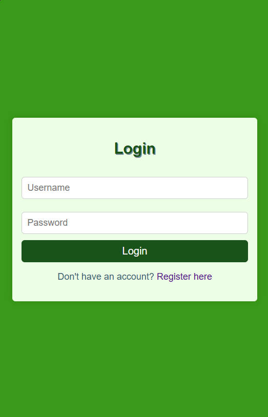

# Grocery-Checklist

<h2>Purpose</h2>

My Grocery-checklist is a simple mobile/web UI that designed to help users efficiently manage their grocery shopping. It provides an organized platform for users to add, edit, remove, check, favorite product list, ensuring they never forget essential items while shopping.

<h2>Key Features</h2>

<h3>User-Friendly Interface:</h3>

• Intuitive layout that allows easy navigation and interaction. 
• Clear labeling of sections and buttons for enhanced usability.

<h3>Add Items:</h3>

• Users can easily add new items to their shopping list through a dedicated input field. 
• A button ("Add To List") facilitates quick additions.

<h3>Edit Items:</h3>

• Allow the users to edit their items.

<h3>Remove Items:</h3>

• Allow the users to remove their items.

<h3>Remove all Items:</h3>

• Allow the users to remove all their items.

<h3>Check Items:</h3>

• Allow the users to check their items by clicking the check-box icon.

<h3>Favorite Items:</h3>

• Allow the users to favaorite their items by clicking the heart icon.

<h3>Categorization:</h3>

• Items can be categorized into different groups such as Fruits, Vegetables, and Snacks, making it easier for users to find what they need. 
• Users can toggle between categories to view specific items.

<h3>Search Functionality:</h3>

• Allow the users to search their products name.

<h3>Responsive Design:</h3>

• The application is optimized for various screen sizes, ensuring a seamless experience on mobile devices and desktops. 
• Media queries adjust the layout for smaller screens, maintaining usability.

<h2>Screenshots</h2>
<table>
	<thead>
		<td>
			<b> Login </b>
		</td>
		<td>
			<b> Grocery List </b>
		</td>
                <td>
			<b> Check Box </b>
		</td>
	</thead>
	<tr>
		<td>
			
		</td>
		<td>
			
		</td>
                <td>
			
		</td>
	</tr>
	<thead>
		<td>
			<b> Modal (add-item) </b>
		</td>
		<td>
			<b> Modal (edit-item) </b>
		</td>
                <td>
			<b> Search Bar </b>
		</td>
	</thead>
	<tr>
		<td>
			
		</td>
		<td>
			
		</td>
                <td>
			
		</td>
	</tr>
	<thead>
		<td>
			<b> Category </b>
		</td>
		<td>
			<b> Sorting </b>
		</td>
	</thead>
	<tr>
		<td>
			
		</td>
		<td>
			
		</td>
	</tr>
</table>
